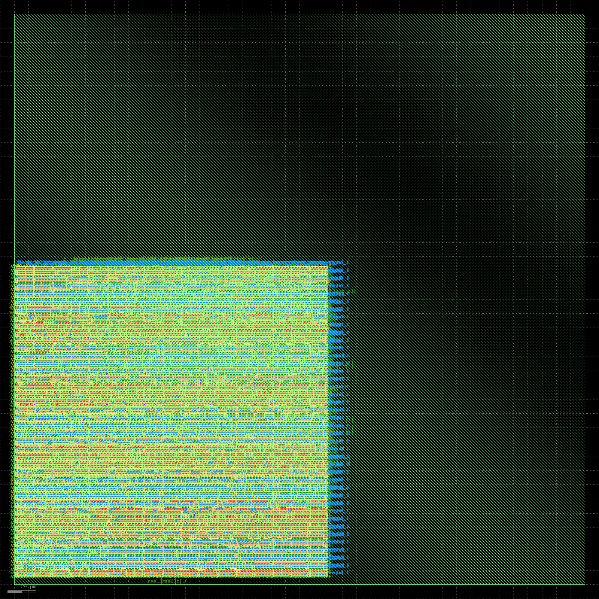

# MAC


A **16-bit BFloat16 multiply–accumulate** unit with an **FP32 accumulator**. Current AI needs optimized workload hardware; MAC is one of those blocks. It's a controller-style datapath built for low-precision ML on a legacy open PDK: BF16 in, FP32 partial sums out, hardened for **SkyWater 130 nm** and targeted at **TinyTapeout 07**.

<p align="center">
  
</p>


The core is a **2-stage pipeline** (`Mul` → `Acc`) behind a **4-cycle streaming bus** over TinyTapeout's 8-bit `ui_in` pin budget. RTL is verified in cocotb; next milestone is **OpenLane / LibreLane hardening** — cross-verified for timing closure → GDSII → shuttle submission. The [design journal](log/) holds the motivation; [docs/](docs/) holds the engineering detail.

---

## Why MAC

MAC is a **silicon datapath project** for the optimized-workload machines AI actually needs. The goal is a real arithmetic block on **130 nm** — small, verifiable, and tapeout-ready on an open flow.

**BF16 is the bet.** Standard FP16 needs wider mantissa multipliers (`11×11` vs `8×8`). BFloat16 keeps FP32's 8-bit exponent — same dynamic range, less silicon — which is what neural networks actually want. Inputs are BF16; the accumulator stays **FP32** so long dot products don't eat themselves on precision.

**Pipeline beats one giant cycle.** A combinational MAC at 50 MHz on Sky130 would likely lose timing on the 32-bit adder and normalization path. Splitting multiply and accumulate into **two stages** buys a clean 20 ns budget per phase.

**I/O is the bottleneck, and that's fine.** TinyTapeout gives you 8 input pins. Two 16-bit operands don't fit in one cycle — so the wrapper streams `A[7:0] → A[15:8] → B[7:0] → B[15:8]` over four clocks and triggers compute on the last byte. Throughput is **1 MAC / 4 cycles** at the pin boundary; the core itself is faster. That's a shuttle constraint, not an architecture mistake.

**Verify before you route.** Cross-verify with rigor: every result is checked against a Python golden model in cocotb — reset, a hand-built `1.0×2.0 + 1.5×2.0` chain, and **1,000 random BF16 vectors** — then harden through OpenLane/LibreLane so timing, DRC, and LVS close before tapeout. Simulation answers "does the logic work?"; the P&R flow answers "does it close on silicon?"

**Built alongside [Tomato](https://github.com/tmarhguy/tomato).** Tomato asked what happens if you replace the conventional ALU with a topology adder — `mux(An, Bn, Cn), mux(An, Bn, Cn), carry_in select` — and taught transistor-to-ISA thinking from the ground up. MAC applies that same build-it-for-real instinct to a block inference hardware needs — see [Reassessing MAC for optimization](log/2026-08-03%20-%20Reassessing%20Mac%20for%20optimization.md).

---

## Run the tests

```bash
cd test && make          # Linux / macOS
cd test; .\run_test.ps1  # Windows
```

Details, screenshots, and methodology: [test/README.md](test/README.md).

---

## Harden (LibreLane)

Local ASIC hardening with LibreLane — **start here** before Tiny Tapeout shuttle work:

```bash
make librelane-check   # one-time Docker + PDK smoke test
make librelane         # full GDS for mac_core
```

Full learning guide: [docs/LIBRELANE.md](docs/LIBRELANE.md).

Tiny Tapeout CI (`gds` workflow) is wired for later shuttle submission; local flow uses `librelane/*.json` configs instead of `tt_tool.py`.

---

## Further reading

| | |
|---|---|
| Architecture, protocol, pipeline | [docs/ARCHITECTURE.md](docs/ARCHITECTURE.md) |
| **LibreLane hardening (local GDS)** | [docs/LIBRELANE.md](docs/LIBRELANE.md) |
| Formats, pins, PPA | [docs/SPECS.md](docs/SPECS.md) |
| Verification strategy | [docs/VERIFICATION.md](docs/VERIFICATION.md) |
| Build journal | [log/](log/) |

---

## License

MIT — see [LICENSE](LICENSE).

---

## Author

**Tyrone Marhguy** — Computer Engineering '28, [University of Pennsylvania](https://www.upenn.edu/)

[tmarhguy@gmail.com](mailto:tmarhguy@gmail.com) · [@tmarhguy](https://github.com/tmarhguy)
