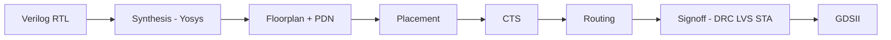

# LibreLane on MAC

This guide walks through hardening the BF16 MAC design with [LibreLane](https://librelane.org) on SkyWater 130 nm — **without** Tiny Tapeout tooling. Tiny Tapeout integration stays in `info.yaml` and CI for later; local learning uses the configs in `librelane/`.

## What you are running

LibreLane is a staged ASIC flow:



We provide two configs:

| Config | Top module | Use |
|--------|------------|-----|
| `librelane/mac_core.json` | `mac_core` | **Start here** — smaller, pure datapath |
| `librelane/tt_um_tensor_mac.json` | `tt_um_tensor_mac` | Full TinyTapeout wrapper + streaming bus |

## Prerequisites

- **Docker** (running)
- **Python 3.9+** on the host (orchestrator only; EDA tools run in the container)
- ~15 GB disk for the LibreLane Docker image (pulled on first run)

### One-time setup

```bash
# Install LibreLane CLI + ciel (PDK manager) on the host
pip3 install 'librelane==2.4.13'

# Add CLI tools to PATH (macOS user install)
export PATH="$HOME/Library/Python/3.9/bin:$PATH"

# Verify Docker + LibreLane (takes several minutes first time)
python3 -m librelane --docker-no-tty --dockerized --smoke-test
```

You should see `Smoke test passed.` at the end.

> **Note:** Tiny Tapeout CI uses LibreLane 3.0.x (Python 3.10+). For local learning we target **2.4.13**, which runs on Python 3.9 and uses the same config JSON format. Upgrade to 3.x when you install Python 3.11+.

## Run the flow

### Full GDS (mac_core)

```bash
make librelane          # default: mac_core → runs/mac/
make librelane-check    # smoke test only
```

Or directly:

```bash
./scripts/librelane.sh mac_core mac
```

Outputs land in `runs/mac/`:

| Path | Contents |
|------|----------|
| `runs/mac/final/gds/mac_core.gds` | Layout for KLayout |
| `runs/mac/final/verilog/mac_core.v` | Gate-level netlist |
| `runs/mac/final/metrics.csv` | Area, cells, timing summary |
| `runs/mac/logs/` | Per-step logs (read these when something fails) |

### Full wrapper (later)

```bash
make librelane-wrapper
```

### Inspect results

```bash
make view-gds          # KLayout app if installed, else PNG preview
make view-gds-preview  # export PNG only (works without KLayout.app)
```

**KLayout GUI (recommended):** install [KLayout for macOS](https://www.klayout.de/build.html), then:

```bash
open -a KLayout runs/mac/final/gds/mac_core.gds
# or
make view-gds
```

`make librelane-klayout` runs KLayout inside Docker and generally **does not** open a window on macOS. Use `make view-gds` instead.

Paths after a successful `make librelane`:

## Learning path (recommended order)

1. **Smoke test** — `make librelane-check` — confirms Docker + PDK inside container.
2. **Synthesis only** — read `runs/mac/logs/synthesis.log` after a run; check cell count and warnings.
3. **Full `mac_core` GDS** — `make librelane` — walk through placement/routing failures in logs.
4. **Tune config** — adjust `DIE_AREA`, `PL_TARGET_DENSITY`, or `CLOCK_PERIOD` in `librelane/mac_core.json`.
5. **Wrapper** — `make librelane-wrapper` when the core closes.
6. **Tiny Tapeout** — re-enable TT CI / shuttle when you want the tile DEF template again.

## Config knobs (mac_core.json)

| Variable | Value | Meaning |
|----------|-------|---------|
| `CLOCK_PERIOD` | `20` | 50 MHz target (ns) |
| `FP_CORE_UTIL` | `40` | Core utilization % — lower = easier routing |
| `PL_TARGET_DENSITY` | `0.45` | Placer density — raise if GPL-0302 placement fails |
| `DIE_AREA` | `400×400 µm` | Generous first pass; shrink after you know area |

If **placement** fails with GPL-0302: increase `PL_TARGET_DENSITY` toward `0.6–0.7` or enlarge `DIE_AREA`.

If **timing** fails: increase `CLOCK_PERIOD` (e.g. `25` for 40 MHz).

If **routing** fails: lower `FP_CORE_UTIL`, enlarge die, or reduce logic (start with `mac_core` only).

## SystemVerilog

`mac_core.sv` uses SystemVerilog (`logic`, `always_ff`). Yosys inside LibreLane reads `.sv` files with SV support. If synthesis fails on SV syntax, check `runs/mac/logs/synthesis/yosys.log`.

## Environment variables

| Variable | Default | Purpose |
|----------|---------|---------|
| `PDK_ROOT` | auto in Docker | Only needed for non-dockerized runs |
| `LIBRELANE_RUN` | `mac` | Run tag / output folder name |

## Troubleshooting

| Symptom | Fix |
|---------|-----|
| `cannot attach stdin to a TTY` | Always pass `--docker-no-tty` **before** `--dockerized` |
| `librelane: command not found` | `export PATH="$HOME/Library/Python/3.9/bin:$PATH"` |
| Docker pull slow | First `smoke-test` downloads ~GB; one-time |
| Synthesis SIGKILL / OOM | Increase Docker Desktop memory to **8 GB+**; refactor reduced Yosys load |
| Area too large for die | Increase `DIE_AREA` in the JSON `pdk::sky130A` block |

## References

- [LibreLane configuration variables](https://librelane.readthedocs.io/en/latest/reference/flow_config_vars.html)
- [UCSC LibreLane tutorial](https://vlsida.github.io/chip-tutorials/librelane.html)
- Project architecture: [ARCHITECTURE.md](ARCHITECTURE.md)
