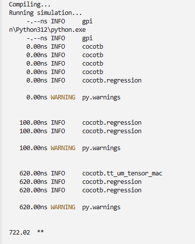
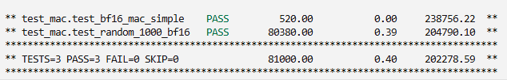

# Verification


cocotb testbench for `tt_um_tensor_mac` + `mac_core`. RTL output is compared against a bit-accurate Python golden model (BF16 truncation emulated in software).

<p align="center">
  
  
</p>

<p align="center"><em>Left: harness run · Right: full regression summary</em></p>

---

## Tests

### Wrapper (`tt_um_tensor_mac`)

| Test | What it checks |
|------|----------------|
| `test_reset` | `rst_n` clears output buffers |
| `test_bf16_mac_simple` | `1.0×2.0 + 1.5×2.0` → **5.0** via streaming protocol |
| `test_random_1000_bf16` | 1,000 random MACs in `[-2, 2]` vs Python reference |

### Core (`mac_core`)

| Test | What it checks |
|------|----------------|
| `test_multiply_overflow` | Large BF16 exponents → FP32 Inf + `overflow` |
| `test_nan_propagation` | BF16 NaN → FP32 quiet NaN |
| `test_inf_times_zero` | Inf × 0 → NaN |
| `test_inf_plus_neg_inf` | +Inf + (−Inf) → NaN |
| `test_accumulate_overflow` | Sticky `overflow` on repeated huge MACs |
| `test_overflow_clear_on_clr_acc` | `clr_acc` clears accumulator and overflow |
| `test_sign_accumulation` | `(+2) + (−3) = −1` mixed-sign accumulate |

---

## Prerequisites

- Python 3.8+
- [Icarus Verilog](https://steveicarus.github.io/iverilog/) (`iverilog`, `vvp`)
- `pip install cocotb numpy`

On Windows, [oss-cad-suite](https://github.com/YosysHQ/oss-cad-suite-release) provides `iverilog` — edit the path in `run_test.ps1` if needed.

---

## Run

### Linux / macOS

```bash
cd test
make          # wrapper tests (3)
make test-core   # mac_core unit tests (7)
make test-all    # both suites
```

### Windows

```powershell
cd test
.\run_test.ps1   # both suites
```

### Expected output

Wrapper: 3 PASS · Core: 7 PASS · **10 total**

---

## Files

| File | Role |
|------|------|
| [test_mac.py](test_mac.py) | cocotb tests — TinyTapeout wrapper + streaming |
| [test_mac_core.py](test_mac_core.py) | cocotb tests — overflow, NaN/Inf, boundaries |
| [Makefile](Makefile) | Wrapper test runner |
| [Makefile.core](Makefile.core) | `mac_core` unit test runner |
| [run_test.ps1](run_test.ps1) | Windows runner |
| [run_test_manual.sh](run_test_manual.sh) | Manual iverilog + vvp flow |

Strategy and coverage goals: [docs/VERIFICATION.md](../docs/VERIFICATION.md).
